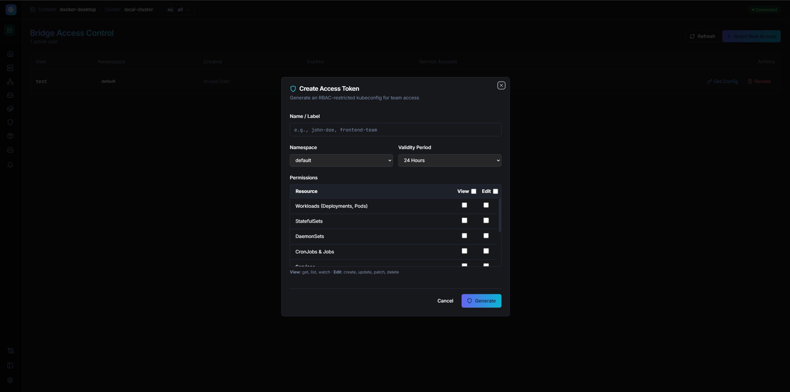
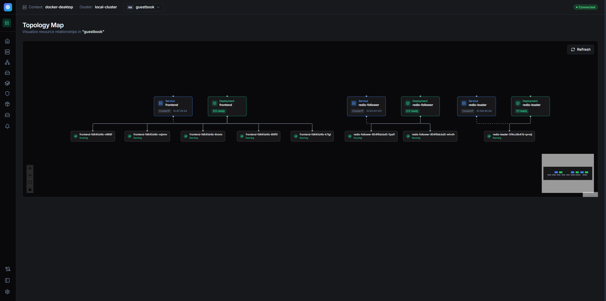
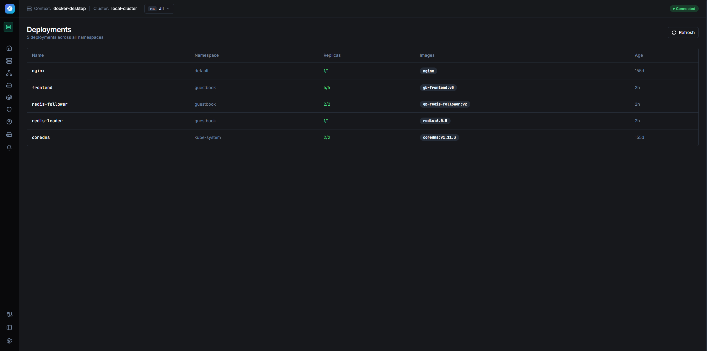
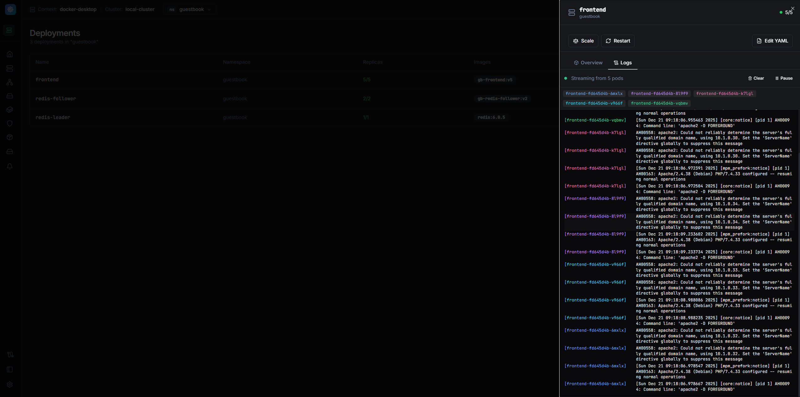
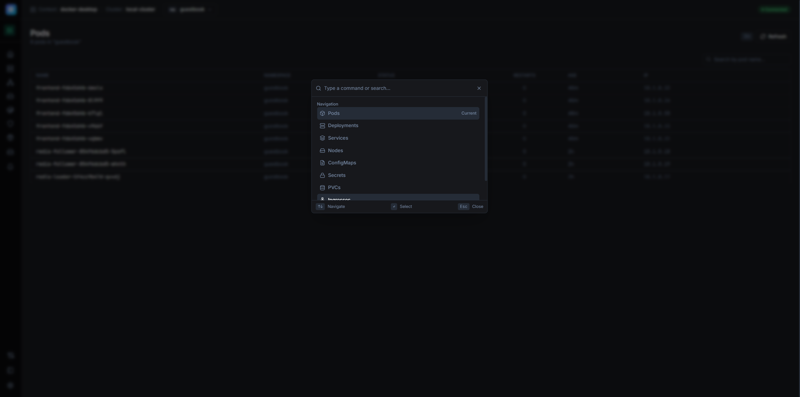

# 🌉 Bridge

**A modern, single-binary Kubernetes dashboard with native AWS SSO integration.**

Bridge provides RBAC-scoped kubeconfig generation, built-in expiration cleanup, and seamless multi-account EKS access — all without external dependencies or database requirements.


---

## 🎯 Why Bridge?

| Problem | Bridge Solution |
|---------|-----------------|
| Managing AWS credentials across 50+ accounts | **Native SSO** — One login, all accounts |
| `aws-iam-authenticator` binary dependency | **Native tokens** — Pure Go, zero binaries |
| Messy `~/.aws/config` with hundreds of profiles | **Isolated mode** — Credentials in `~/.bridge/` |
| "Unable to locate credentials" spam | **Clean logging** — Clear status indicators |
| Complex RBAC setup for temporary access | **One-click grants** — Automatic cleanup |

---

## ✨ Features

### 🔐 AWS SSO Integration (NEW!)

> **The Leapp-Style Experience** — Connect to all your EKS clusters without polluting global AWS config.

- **Device Code Flow** — Browser-based SSO login with visual user code
- **Multi-Account Discovery** — Automatically sync all accounts and roles
- **Context Mapping** — Link Kubernetes contexts to AWS SSO roles
- **Native EKS Tokens** — Bypasses `aws-iam-authenticator` entirely
- **Isolated Credentials** — Stored in `~/.bridge/`, not `~/.aws/config`
- **Smart Re-authentication** — Auto-triggers login when session expires

```
✅ [Auth] Bridge Identity used for context: prod-cluster -> 123456789/AdministratorAccess
✅ [Auth] Native EKS token generated (expires: 2025-12-22T20:30:00Z)
✅ [Context] Loaded: prod-cluster (cluster: https://xxx.eks.amazonaws.com)
```

### 🎫 Access Control

- **Scoped Kubeconfig Generation** — Create time-limited kubeconfigs with precise RBAC permissions
- **Namespace-Level Isolation** — Grant access to specific namespaces only
- **Automatic Expiration** — Built-in janitor cleans up expired ServiceAccounts, Roles, and RoleBindings
- **Zero Database** — Purely stateless, uses Kubernetes as the source of truth

### 📊 Dashboard

- **Mission Control** — Real-time cluster health, active users, and expiring tokens at a glance
- **Connection Status** — Live indicator showing cluster connectivity (Connected/Degraded/Disconnected)
- **Workload Explorer** — Browse Pods, Deployments, StatefulSets, DaemonSets, and CronJobs
- **Network View** — Services, Ingresses, and Network Policies
- **Storage Management** — PVCs, PVs, and Storage Classes
- **Configuration** — ConfigMaps and Secrets with reveal functionality
- **RBAC Viewer** — ServiceAccounts, Roles, RoleBindings, ClusterRoles
- **Custom Resources** — Browse and explore CRDs and their instances

### 🗺️ Visualization

- **Topology Map** — Interactive visualization of Ingress → Service → Deployment → Pod relationships
- **Context Switching** — Seamlessly switch between multiple Kubernetes clusters
- **Real-time Logs** — Stream pod logs via WebSocket with aggregated multi-pod view
- **Command Palette** — `⌘K` for instant navigation

### ⚡ Developer Experience

- **Single Binary** — No external dependencies, just download and run
- **Embedded UI** — Frontend compiled into the Go binary
- **Port Forwarding** — Built-in tunnel management for local development
- **Helm Integration** — View Helm releases and their resources

---

## 🚀 Quick Start

### Download

Grab the latest release for your platform:

| Platform | Download |
|----------|----------|
| Linux (AMD64) | `bridge-linux-amd64` |
| Linux (ARM64) | `bridge-linux-arm64` |
| macOS (Intel) | `bridge-darwin-amd64` |
| macOS (Apple Silicon) | `bridge-darwin-arm64` |
| Windows | `bridge-windows-amd64.exe` |

### Run

```bash
# Linux / macOS
chmod +x bridge-*
./bridge-linux-amd64  # or your platform

# Windows
.\bridge-windows-amd64.exe
```

Open **http://localhost:8080** in your browser.

> **Note:** Bridge uses your local `~/.kube/config` to connect to clusters. Make sure you have a valid kubeconfig.

---

## 🔗 AWS SSO Setup

### 1. Add Your SSO Session

Navigate to **AWS SSO** in the sidebar, then click **Add Session**:

```
SSO Start URL: https://your-company.awsapps.com/start
Region: us-east-1
```

### 2. Complete Device Authorization

Bridge displays a user code (e.g., `WDJM-QDJS`). Click to open AWS and authorize.

### 3. Sync Accounts

Click **Sync** to discover all accounts and roles available to you.

### 4. Map Contexts

For each EKS cluster, click **Map to Cluster** and select the appropriate AWS role:

```
Context: arn:aws:eks:us-east-1:123456789:cluster/prod
  └── Maps to: 123456789 / AdministratorAccess
```

### 5. Connect!

Bridge now uses native authentication. No `aws-iam-authenticator` required.

```bash
# Your existing kubectl commands just work
kubectl get pods  # ✅ Uses Bridge's native EKS token
```

---

## 🏗️ Building from Source

### Prerequisites

- Go 1.21+
- Node.js 18+
- npm

### Development

```bash
# Clone the repo
git clone https://github.com/yourusername/bridge.git
cd bridge

# Start frontend dev server (Terminal 1)
cd frontend && npm install && npm run dev

# Start backend (Terminal 2)
cd backend && go run .
```

Frontend runs on `http://localhost:3000` with hot reload.
Backend API runs on `http://localhost:8080`.

### Production Build

```bash
# Build single binary for current platform
make build
./backend/bridge

# Build release binaries for all platforms
make release
ls -la bin/
```

---

## 🎛️ Configuration

| Environment Variable | Default | Description |
|---------------------|---------|-------------|
| `PORT` | `8080` | HTTP server port |
| `KUBECONFIG` | `~/.kube/config` | Path to kubeconfig file |

### Data Directories

| Directory | Purpose |
|-----------|---------|
| `~/.bridge/tokens/` | SSO access tokens |
| `~/.bridge/sessions/` | SSO session metadata |
| `~/.bridge/context-mappings.json` | Context → AWS role mappings |

---

## 📸 Screenshots

<details>
<summary>Click to expand screenshots</summary>

### Mission Control Dashboard
Real-time overview of cluster health, active access grants, and quick actions.


### AWS SSO Identity Manager
Browser-based SSO login with account tree explorer.


### Team Access Control
Generate scoped kubeconfigs with specific permissions and expiration times.



### Topology Map
Interactive visualization of your cluster's network topology.



### Workload Explorer
Browse and manage pods, deployments, and other workloads.



### Real-time Logs
Stream pod logs via WebSocket.



### Command Palette (⌘K)
Quick navigation and actions with keyboard-first design.



</details>

---

## 🔐 How Access Control Works

1. **Admin creates access grant** with:
   - User label (for identification)
   - Target namespace
   - Permission level (read-only, power-user, or custom)
   - Expiration duration (or permanent)

2. **Bridge creates Kubernetes resources**:
   - `ServiceAccount` with labels and annotations
   - `Role` with specified permissions
   - `RoleBinding` to connect them
   - Token via `TokenRequest` API

3. **User receives kubeconfig** that works immediately

4. **Janitor cleans up** expired resources every 10 minutes

All state lives in Kubernetes — Bridge itself is completely stateless.

---

## 🔑 How AWS SSO Authentication Works

```
┌─────────────┐     ┌─────────────┐     ┌─────────────┐
│   Bridge    │────▶│  AWS SSO    │────▶│     EKS     │
│  Dashboard  │     │   OIDC      │     │   Cluster   │
└─────────────┘     └─────────────┘     └─────────────┘
      │                    │                    │
      │  1. Device Code    │                    │
      │◀───────────────────│                    │
      │                    │                    │
      │  2. User Approves  │                    │
      │───────────────────▶│                    │
      │                    │                    │
      │  3. Access Token   │                    │
      │◀───────────────────│                    │
      │                    │                    │
      │  4. GetRoleCredentials                  │
      │───────────────────▶│                    │
      │                    │                    │
      │  5. Temp AK/SK/Token                    │
      │◀───────────────────│                    │
      │                    │                    │
      │  6. Presigned STS GetCallerIdentity     │
      │─────────────────────────────────────────▶
      │                    │                    │
      │  7. k8s-aws-v1.xxx EKS Token           │
      │─────────────────────────────────────────▶
```

**Key Innovation**: Bridge generates EKS tokens natively using `aws-sdk-go-v2`, eliminating the need for `aws-iam-authenticator` binary.

---

## 🛠️ Tech Stack

| Component | Technology |
|-----------|------------|
| Backend | Go, Gin, client-go, aws-sdk-go-v2 |
| Frontend | React 18, TypeScript, Vite |
| Styling | Tailwind CSS, shadcn/ui |
| State | TanStack Query, Zustand |
| Visualization | ReactFlow, Dagre |

---

## 📋 Roadmap

- [x] AWS SSO device authorization flow
- [x] Native EKS token generation
- [x] Multi-account context mapping
- [x] Smart re-authentication
- [ ] Google Cloud (GKE) integration
- [ ] Azure (AKS) integration
- [ ] Multi-cluster federation
- [ ] Audit logging

---

## 📄 License

MIT License — see [LICENSE](LICENSE) for details.

---

## 🤝 Contributing

Contributions are welcome! Please feel free to submit a Pull Request.

1. Fork the repository
2. Create your feature branch (`git checkout -b feature/amazing-feature`)
3. Commit your changes (`git commit -m 'Add some amazing feature'`)
4. Push to the branch (`git push origin feature/amazing-feature`)
5. Open a Pull Request

---

<p align="center">
  <sub>Built with ❤️ for platform engineers who manage too many AWS accounts</sub>
</p>
